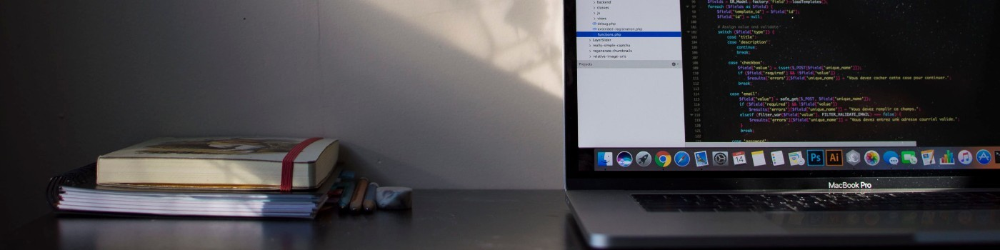

<!-- Banner Initial -->

## Hello World :love_you_gesture:

<!-- Social Contact -->

   
  
   

 

<!-- Description -->

   Inicie no mundo da programação a finais de 2020 e sem dúvidas é a melhor decisão já tomada, 
   aprendi que <strong>"Sim se pode sonhar, se pode programar"</strong>. 
   Atualmente a minha stack é <strong>ReactJS</strong> e pretendo me aprimorar com a <strong>OmniStack (Node.js, ReactJS e React Native)</strong>.

 

<!-- Skills -->

  <!-- HTML Icon -->
  &nbsp;
  <!-- CSS Icon -->
  &nbsp;
  <!-- SASS Icon -->
  &nbsp;
  <!-- JS Icon -->
  &nbsp;
  <!-- React Icon -->
  &nbsp;
  <!-- Webpack Icon -->
  &nbsp;
  <!-- Git Icon -->
  &nbsp;
  <!-- Github Icon -->
  &nbsp;

 

<!-- Cards -->
<table align="center">
  <row>
    <td>
      
    </td>
    <td>
      
    </td>
  </row>
</table> 

<!--
**EzioMora/EzioMora** is a ✨ _special_ ✨ repository because its `README.md` (this file) appears on your GitHub profile.

Here are some ideas to get you started:

- 🔭 I’m currently working on ...
- 🌱 I’m currently learning ...
- 👯 I’m looking to collaborate on ...
- 🤔 I’m looking for help with ...
- 💬 Ask me about ...
- 📫 How to reach me: ...
- 😄 Pronouns: ...
- ⚡ Fun fact: ...
-->
